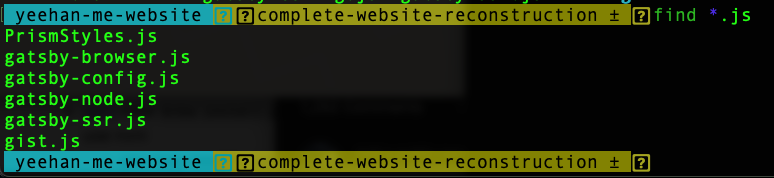
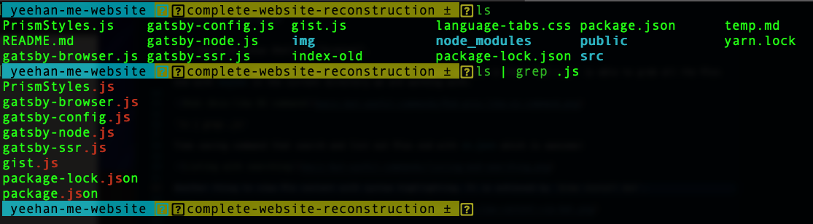
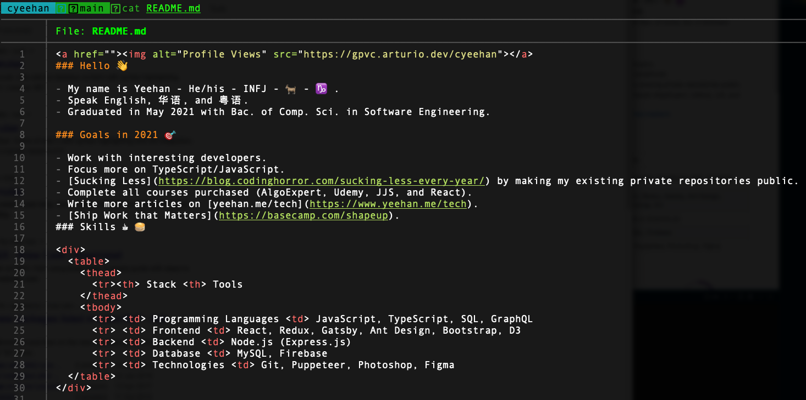

It's based on Linux Shell or "Terminal".

Before started, what Unix-like OS command brings? A good example is that `find *.js` is able to grab all the files end with **.js** in the current directory we are working with.

`ls | grep .js`

Time-saving command that search and list out files end with **.js** which is quite similar to `find`, but with highlighting this time.

Another useful stuff is that viewing file content with syntax highlighting. It is achieved by `brew install bat`.

## Resources

- [ThePrimeagen](https://www.youtube.com/c/ThePrimeagen): He has posted a lot of videos messing around `VIM`.
  - [Command Line - Fu - sed + find tricks](https://www.youtube.com/watch?v=CyVV2FI7-DE)
  - [How to use Xargs!!! | Linux Core Utils](https://www.youtube.com/watch?v=5EFY5ztZb00)
- [Bash shell command cheat sheet](https://www.educative.io/blog/bash-shell-command-cheat-sheet)
