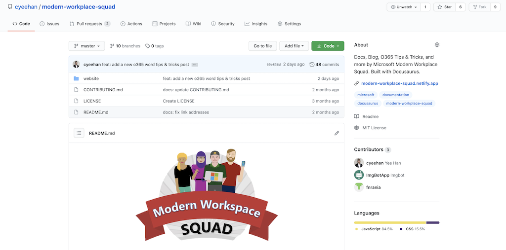
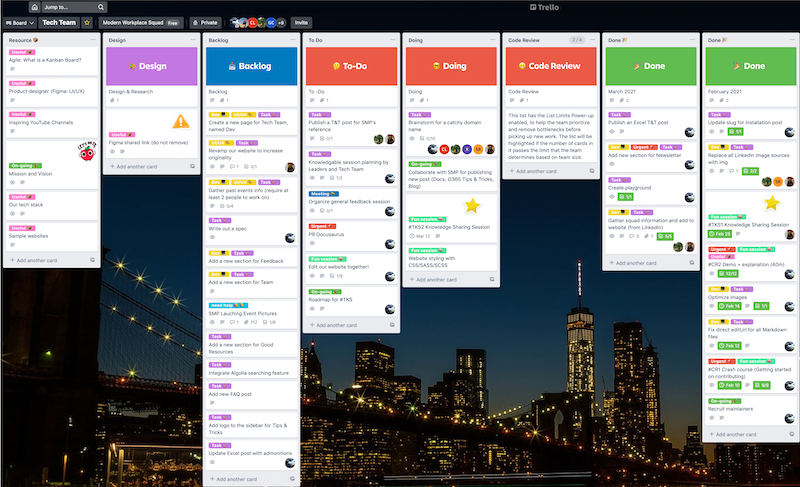
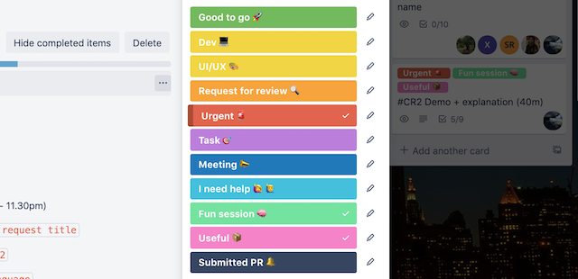

## Keywords

- MWS (Modern Workplace Squad)
- SMP (Social Media Programme)
- OKS (O365 Knowledgable Session)
- TKS (Tech Knowledgable Session)

## TL;DR

It was exciting yet challenging to build a [community-driven website](https://modern-workplace-squad.netlify.app/). Really appreciate the squad for providing the contents for the website.

## A little background information

Recently, the idea of having our own website was proposed to our Head of Microsoft MWS, Mun Hong. It's because a website would increase our exposure on the internet by allowing students, educators, employees, and employers to view what we've organized and achieved in the past.

Then, Mun Hong added on saying that we could have Tips & Tricks section, which is a very good idea. It makes the whole website idea more viable! Hence, **MWS Tech Team** is born. Why Tech Team, right?

One of the motivating reasons is that it will bring value to the people looking for Office 365 Tips & Tricks that would help them to improve productivity.

Our group photo taken during the first Tech Team session:

## GitHub Repository

## Project Management

To facilitate all the project management processes, [Trello Kanban board](https://blog.hubstaff.com/kanban-with-trello/#:~:text=Trello%20Kanban%20board%20alternative&text=It%20enables%20teams%20to%20quickly,their%20work%20in%20weekly%20sprints.) was chosen to keep track of our progress and increase project transparency so that everyone is on the same page.

### Trello Kanban board

### Labels

To fully utilize Trello, we make good use of the labels by giving them descriptive names.

## What's more exciting about MWS Tech Team?

We have TKS, aka **Tech Knowledgable Session** that would be held once per month, at least for now. The speaker could pick any topic to share among the Tech Team, which would be a really good engagement session. We get to learn and grow together and discover hidden talents and potentials.

## A pretty good question about this initiative

> Ariful: What can we look forward to as the MWS Tech Team?

Yeap, what are the purposes of all these initiatives? It can start with what we will achieve together and then talk about personal achievement.

### What we'll achieve together?

Tech Team will collaborate with SMP (Social Media Programme), which is another team responsible for the three social media platforms ([Facebook](https://www.facebook.com/microsoft.mws), [Instagram](https://www.instagram.com/microsoft_mws/), and [LinkedIn](https://www.linkedin.com/company/mwsquad/)) of Microsoft MWS to scale our website to its fullest potential. How does it work? For instance, a Tips & Tricks post created by the SMP will post to our website by the Tech Team. Furthermore, our work will not only benefit students, educators, employees, and employers from Malaysia, but also people across the globe.

### How about personal achievement?

For personal achievement, you reap what you sow, and there is no clear answer to this because there is no restriction or limitation on how we utilize our creativity to develop something valuable for Microsoft MWS. It's all based on self-initiative.

## Closing

There are [3 lessons in avoiding burnout you can steal from emergency room doctors](https://www.inc.com/jessica-stillman/leadership-tips-stress-burnout-health-care.html), and thankfully, they can be applied here. One of the key takeaways:

> "A stack of studies indicates that perseverance doesn't come from turning off your emotions and keeping a stiff upper lip. It comes from really caring about what you're doing."
