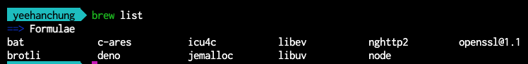

While referring to my Mac setup below, should take a look at **swyx**'s new Mac setup [video](https://www.youtube.com/watch?v=qwflfsgU0eg).

- **Browsers**:
  - Download `Chrome` / `Canary` and `Brave`, set `Chrome` to default
  - Page zoom 80%
- **Login**:
  1. GitHub
  2. Gmail
  3. Trello
  4. Notes using iCloud (Grammar and Spelling -> **Deselect all**)
- **MacOS system settings**:
  - Disable Spotlight search for all miscellaneous crap except apps, and system preferences. Especially `Developer option`
  - Ensure to add `xcode.app` to **/Applications**
  - Disable `Ask Siri`
  - Fix trackpad direction: Trackpad -> Scroll & Zoom -> `Natural off`
  - Increase trackpad + mouse sensitivity
- **Finder settings**:
  - Preferences -> `show filename extensions`
  - Enable showing dotfiles (just hold `cmd` + shift + `dot` keystroke) in a Finder window
  - [Show path bar](https://www.tekrevue.com/tip/show-path-finder-title-bar/) in footer for easier navigation
- **Keyboard**:
  - Shortcuts: copy picture of selected area to clipboard -> `cmd` + `e`
  - Remap `cmd` + `q` to anything else to prevent accidental `close-all`
  - Key Repeat: `off`
  - Text tab unselect 3 items: `correct..`, `capitalise..` and `add full stop..`
- **MacOS Dock**:
  - Remove everything except - `Finder`, `System Preferences`, and `Trash`
  - Turn Dock `Auto Hiding` on
- **Chrome extensions**:
  - [Paywall blocker](https://github.com/iamadamdev/bypass-paywalls-chrome/)
  - [React Devtools](https://chrome.google.com/webstore/detail/react-developer-tools/fmkadmapgofadopljbjfkapdkoienihi?hl=en)
  - [Octohint](https://github.com/pd4d10/octohint)
  - [OctoLinker](https://chrome.google.com/webstore/detail/octolinker/jlmafbaeoofdegohdhinkhilhclaklkp/related?hl=en)
  - [Wappalyzer](https://www.wappalyzer.com/)
  - [JSON Viewer](https://chrome.google.com/webstore/detail/json-viewer/gbmdgpbipfallnflgajpaliibnhdgobh)
- **Terminal environments**:
  - My [dotfiles](https://gist.github.com/cyeehan/fa7d1732b531c161784aee602c1366a0).
  - [ZSH](https://ohmyz.sh/) - first usage of git will prompt you to install `git` (takes 15 minutes)
  - `git config --global user.name "cyeehan"`
  - `git config --global user.email cyh0011215@gmail.com`
  - Font - [Inconsolata for Powerline](https://github.com/powerline/fonts/blob/master/Inconsolata/Inconsolata%20for%20Powerline.otf)
  - [autosuggestions](https://github.com/zsh-users/zsh-autosuggestions)
  - [syntax highlighting](https://github.com/zsh-users/zsh-syntax-highlighting)
  - [Hyper](https://hyper.is/) Terminal.
    - settings: [shell: '/bin/zsh'](https://gist.github.com/robertcoopercode/276d7cf66e9b0eea48c117fff1762a17#file-hyper-js-L60)
    - settings: `fontFamily: '"Inconsolata for Powerline", Menlo, "DejaVu Sans Mono", Consolas, "Lucida Console", monospace'`,
    - [Fig](https://fig.io/) (Search `Fig` on `yeehanchung@gmail.com`)
      - More CLI tools recommended by the founder of Fig - [zsh abbreviations](https://github.com/momo-lab/zsh-abbrev-alias).
  - [Homebrew](https://brew.sh/)
    - 
    - [GitHub CLI](https://github.com/cli/cli)
    - `brew install bat`
    - `brew install deno`
    - `brew install node` | [NPM](https://nodejs.org/en/download/)
- **Apps**
  - [Stretchly](https://hovancik.net/stretchly/) (better rest time)
  - [LICEcap](https://www.cockos.com/licecap/) (make Gifs)
  - [SimpleNote](https://simplenote.com/) | [App store](https://apps.apple.com/us/app/simplenote/id692867256?ls=1&mt=12)
  - [Kap](https://getkap.co/) (video capture)
  - [Caffeine](https://intelliscapesolutions.com/apps/caffeine) (keep Mac awake)
  - [Clipboard manager](https://clipy-app.com/)
  - [Emoji on Mac](https://matthewpalmer.net/rocket/)
  - [Magnet](https://apps.apple.com/us/app/magnet) - luxurious
  - [DaisyDisk](https://daisydiskapp.com/) - luxurious
  - [iStat Menus 6](https://bjango.com/mac/istatmenus/) - luxurious | check my personal email cyh001..

## References

- [swyx's new mac setup 2021](https://www.swyx.io/new-mac-setup-2021/)
  - [swyx's dev.to post](https://dev.to/swyx/my-new-mac-setup-4ibi)
