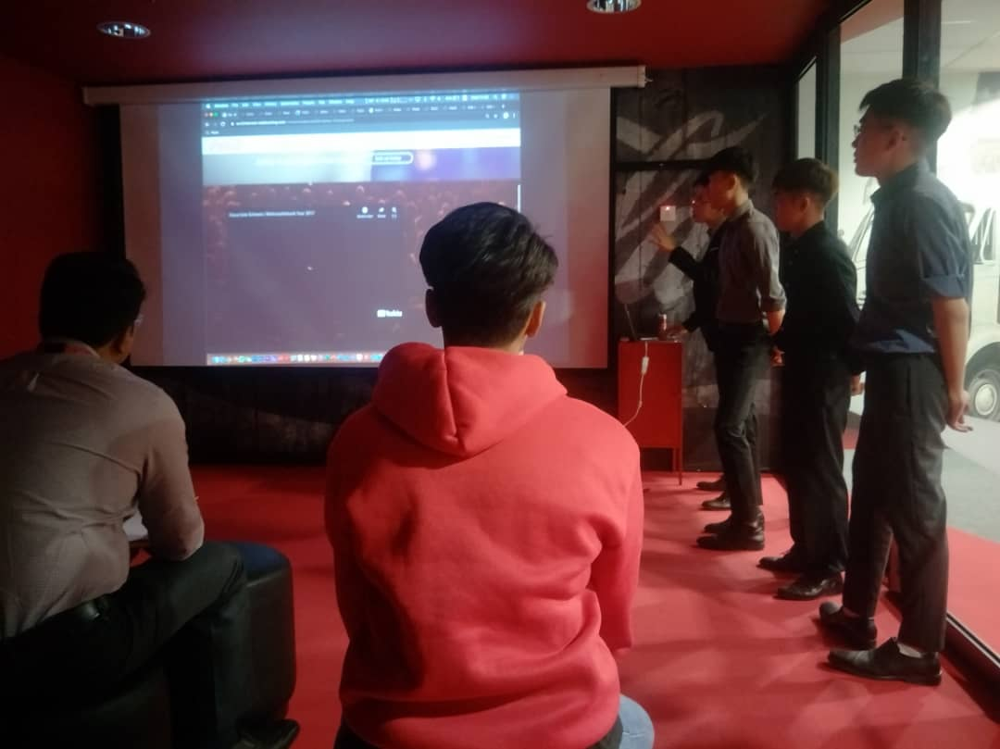

<!--
date must be: 2000-01-01
NOT: 2000-1-1 -->

<!-- https://www.gatsbyjs.com/blog/2017-07-19-creating-a-blog-with-gatsby/#writing-our-first-markdown-blog-post -->
<!-- https://github.com/gatsbyjs/gatsby/issues/3460 -->
<!-- https://mdxjs.com/getting-started#mdx -->

## Professional Experiences
        
### Software Engineer Intern @ Fusionex International
        
#### Jan 2021 - Present | Petaling Jaya, Malaysia

- Software and web application development in the core team.
- Integrated API, write clean and reusable codes.
- Conducted code reviews and supported system integration testing.
- Write documentation (database schema, REST API, and new implementations).
- Tech stack: **WordPress** (**PHP**, **JavaScript**, **jQuery/Ajax**), **Express.js** (**Node.js**), **REST API**, **Git**.

<!-- Education -->

## Education

### INTI International University + Coventry University, UK

#### Apr 2018 - May 2021 | Malaysia

- Bachelor of Computer Science (Hons), majoring in Software Engineering.
- CGPA: 3.85/4.00 (First Class Honours).

<!-- Projects -->

## Projects

### E-commerce web app & Blog website (mobile-responsive)

#### Individual Final Year Employer Project

- Client: [Sausage KL Café & Deli](https://www.tripadvisor.com.my/Restaurant_Review-g298570-d15042368-Reviews-Sausage_KL_Cafe_Deli-Kuala_Lumpur_Wilayah_Persekutuan.html)
- Assisted Sausage KL to gain MYR 641 and accumulated 185 views within 8 days.
- Involved in full SDLC (Software Development Life Cycle).
- Fulfilled user requirements together with ISO 25010 software quality model.
- Tech stack: **React.js**, **Redux**, **Gatsby**, **GraphQL**, **Firestore**, **Google Analytics**, **Git**, **Netlify**, **Heroku**.
- Websites: (1) [sausagekl.com](http://www.sausagekl.com/) & (2) [blog.sausagekl.com](https://www.blog.sausagekl.com/)

### Covid-19 Medicine & QR Code Scanner Android Apps

- Led a team of 3. Architected, developed, documented, and pitched final products.
- Tech stack: **Java**, **XML**, **Git**, **Google Firebase**, **Covid-19 API**.
- Tools: **Android Studio**, **Power Automate**, **Power BI**, **Microsoft Forms**.
- GitHub repository: (1) [Medicine App](https://github.com/cyeehan/medicine-covid-19-health-check), (2) [Special QR Code Scanner](https://github.com/cyeehan/medicine-qr-code-scanner)

### Office 365 Educational Website
- Self-initiated for Microsoft Modern Workplace Squad to increase creditability.
- Lead a team of 10+ as a developer and project manager. 
- Provide code review and training. 
- Tech stack: **React.js**, **CSS**, **Markdown**, **Git**, **Netlify**, **Google Analytics**.
- Tools: **Docusaurus**, **VSCode**, **Figma**, **Trello**.
- Website: [modern-workplace-squad.netlify.app](https://modern-workplace-squad.netlify.app/)
- GitHub repository: [modern-workplace-squad](https://github.com/cyeehan/modern-workplace-squad)

<!-- Publication -->

## Publication

### A Study of Software Quality Assurance Perspective on E-commerce System Development

- Main author. Paper is under review by a publisher from the US.

<!-- Leadership experience -->

## Leadership Experience

### Modern Workplace Ambassador @ Microsoft Malaysia

#### Apr 2019 - Present | Malaysia

- Campus Squad Leader for 3 months.
- Self-initiated a Tech Team of 10+ to scale our [website](https://modern-workplace-squad.netlify.app/) to provide useful O365 tips & tricks.
- Increased 700+ Microsoft Teams account activation, and helped Microsoft Malaysia won an award.
- Organized 3-day Virtual Training & Recruitment Sessions for 170+ students and received 4.68/5 avg. rating.
- Organized 3 training sessions, 1 virtual recruitment session, and 1 virtual onboarding session.
- Provided Office 365 training to 150+ students across campuses (virtually and physically).

### Student Leader Ambassador @ INTI International University

#### Jul 2018 - Present | Malaysia

- Interviewed 30+ undergraduate and graduate students during recruitment of new Leader Ambassadors.
- Moderated Virtual Hiring Session with Exabytes Group and Dim Tai Fung in 2020.
- Led a team of 13 to provide résumé writing tips & tricks to 80+ students to increase employability.
- Professionally produced two [Career Fair videos](https://www.facebook.com/intiiu.cs/videos) and five [interview videos](https://www.facebook.com/intiiu.cs/videos) using Adobe Premiere Pro.
- Professionally supported in designing three [Career Fair posters](https://www.facebook.com/intiiu.cs/photos) using Photoshop.
- Facilitated 5 Industry Advisory Board events and Partnership Appreciation Dinner.

### Program Master @ INTI International University IT Club

#### Jan 2019 - Nov 2019 | Malaysia

- Coordinator of Office 365 Training with 60+ students.
- Chair-organized Python Programming Workshop for 20+ students.
- Program Master of Arduino Programming Workshop for 80+ students.

<!-- Awards and Achievements -->

## Awards and Achievements

### 2020

- 1st Runner Up in **Coca-Cola Automation Employer Project**.
- Being a team lead, full-stack developer and presenter.
- Developed 2 attractive landing pages.
- Digitised 20+ physical registration forms.
- Developed a login system and an administrative dashboard with CRUD operations.
- Pitched final system to Coca-Cola Malaysia Managing Director and employers.
- Tech stack: **HTML**, **CSS**, **SQL**, **PHP**, **Bootstrap**, **phpMyAdmin**, **PhpStorm**.

