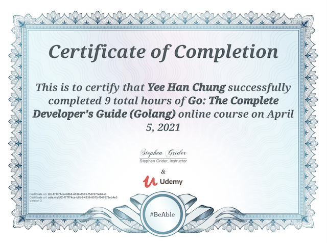

## 💼 Professional Experience

### Software Engineer @ Eezee

#### Jun 2021 - Present @ Singapore 🇸🇬

- [Eezee.sg](https://eezee.sg/about-us) is Singapore's largest B2B marketplace for industrial and business supplies. We are committed to providing a customer-centric eCommerce experience that is easy, transparent and secure.

<!-- 
- Automate test cases of both external and internal platforms to improve site-reliability, and visibility for stakeholders.
- Tech stack: Next.js (TypeScript), Node.js (Express.js), JavaScript, CSS/XPATH, Jest, Puppeteer, UI-licious
-->

### Software Engineer Intern @ Fusionex International

#### Jan 2021 - Apr 2021 @ Malaysia 🇲🇾

  
View contributions

  <ul>
    <li>Received a Return Offer.</li>
    <li>Involved in E-commerce web app development in the core team.</li>
    <li>Conducted code review and documentation review.</li>
    <li>Integrated API and libraries for services, and data visualization.</li>
    <li>Built RESTful services to generate developed customizable financial reports.</li>
    <li>Supported UAT (User Acceptance Testing) & SIT (System Integration Testing).</li>
    <li>Documented data visualization manual for users, and self-learned D3 with React.js.</li>
    <li>Documentation (database schema, RESTful services, and new PHP implementations).</li>
    <li>Created SQL queries (join, views, when-case, JSON, files, etc.) for data analysis dashboard.</li>
    <li>Tech stack: <b>Node.js</b>, <b>PHP</b>, <b>JavaScript</b>, <b>jQuery/Ajax</b>, <b>RESTful API</b>, <b>MySQL</b>, <b>Git</b>, <b>.Net Core</b>, <b>Bootstrap</b>.</li>
  </ul>

<!-- Education -->

## 🎓 Education

### INTI International University + Coventry University, UK

#### Apr 2018 - May 2021 @ Malaysia 🇲🇾

- Bachelor of Computer Science (Hons).
- Majored in **Software Engineering**.
- CGPA: 3.85/4.00 (First Class Honours).

<!-- Projects -->

## 🥞 Projects

### E-commerce web app & blog website

#### Final Year Project (Individual Employer Project)

- Handled food delivery orders: Total of RM8750 within 5 months (organic).
- Fulfilled user requirements together with ISO 25010 software quality model.
- Involved in full SDLC (Software Development Life Cycle), and documentation.
- Tech stack of [E-commerce](http://www.sausagekl.com/): **React**, **Redux**, **Bootstrap**, **Google Firebase**, **SCSS**, **Git**, **Heroku**.
- Tech stack of [Admin dashboard](http://www.sausagekl.com/): **React**, **Redux**, **Ant Design**, **Google Firebase**, **SCSS**, **Git**.
- Tech stack of [Blog](https://prettier-jones-267440.netlify.app/): **Gatsby**, **GraphQL**, **styled-components**, **SCSS**, **Git**, **Netlify**.

### Office 365 educational website

- Led a team of 7 using Kanban boards to scale our [educational website](https://modern-workplace-squad.netlify.app/) to provide O365 tips & tricks.
- Conducted code reviews and provided internal training sessions.
- Tech stack: **React**, **Git**, **CSS/SCSS**, **Markdown**, **Vercel**.
- Tools: **Docusaurus**, **VSCode**, **Trello**.
- [Website](https://modern-workplace-squad.netlify.app/) | [GitHub repository](https://github.com/cyeehan/modern-workplace-squad)

### Developer's blog website

- Shared my knowledge on software or web app development.
- Topics include API, CLI, CSS, Docusaurus, Gatsby, Git, JavaScript, React, Redux, WordPress, etc.
- Tech stack of [Blog](https://yeehan.dev/): **Gatsby**, **GraphQL**, **Git**, **CSS/SCSS**, **Markdown**, **Netlify**.

### Covid-19 medicine & QR code scanner android apps

- Led a team of 3. Architected, developed, documented, and pitched final products.
- Tech stack: **Java**, **XML**, **Git**, **Google Firebase**, **Covid-19 API**.
- Tools: **Android Studio**, **Power Automate**, **Power BI**, **Microsoft Forms**.
- GitHub repository: (1) [Medicine App](https://github.com/cyeehan/medicine-covid-19-health-check), (2) [Special QR Code Scanner](https://github.com/cyeehan/medicine-qr-code-scanner)

<!-- Leadership experience -->

## 🚀 Leadership Experience

<!-- 1st -->

### Modern Workplace Ambassador @ Microsoft Malaysia

#### Apr 2019 - Present @ Malaysia 🇲🇾

- Currently acting the web developer role to maintain our educational [website](https://modern-workplace-squad.netlify.app/).
- Started as a good subordinate, and gradually a **campus squad leader** for 3 months.
- Led a team of 7 using Kanban boards to scale our [educational website](https://modern-workplace-squad.netlify.app/) to provide O365 Tips & Tricks.
- Increased 700+ Microsoft Teams account activation, and helped Microsoft Malaysia won an award.
- Organized 3-day Virtual Training & Recruitment Sessions for 170+ students and received 4.68/5 avg. rating.
- Organized 3 training sessions, 1 virtual recruitment session, and 1 virtual onboarding session.
- Provided Office 365 training to 150+ students across campuses (virtually and physically).

     

<!-- 2nd -->

### Career Services Student Ambassador @ INTI International University

#### Jul 2018 - Jan 2021 @ Malaysia 🇲🇾

- Created a comprehensive [resume template](https://drive.google.com/file/d/16uEYEffSm55oq8GoI5FMexFYoLQ8_VmU/view?usp=sharing) for INTI students to increase employability.
- Moderated 2 Virtual Hiring Sessions with [**Exabytes Group**](https://www.exabytes.my/about) and [**Dim Tai Fung**](https://www.dintaifung.com.my/) in 2020.
- Interviewed 30+ undergraduate and graduate students during recruitment of new Leader Ambassadors.
- Led a team of 13 to provide résumé writing tips & tricks to 80+ students to increase employability.
- As organizing committee of 3 Career Fairs. Produced 7 videos and 3 posters using Premiere Pro and Photoshop.
- Facilitated 5 Industry Advisory Boards and 1 INTI’s Partnership Appreciation Dinner.

     

<!-- 3rd -->

### Program Master @ INTI International University IT Club

#### Jan 2019 - Nov 2019 @ Malaysia 🇲🇾

- Coordinator of Office 365 Training with 60+ students.
- Chair-organized Python Programming Workshop for 20+ students.
- Program Master of Arduino Programming Workshop for 80+ students.

  

<!-- Awards and Achievements -->

## 🏅 Awards and Achievement

### Published a paper as the main author (2020)

- Title: **A Study of Software Quality Assurance Perspective on E-commerce System Development**.
- Summarized recent studies about Scrum, Kanban, XP, and ISO/IEC 25010 for E-commerce systems.
- Suggested good practices of Scrum software development methodology and ISO/IEC 25010 for system development.

### 1st Runner Up in Coca-Cola Automation Employer Project (2020)

- As the **team lead**, **full-stack developer**, and **presenter**.
- Developed 2 attractive landing pages and digitised 20+ physical registration forms.
- Developed a login system and an administrative dashboard with CRUD operations.
- Pitched final system to Coca-Cola Malaysia Managing Director and employers.
- Tech stack: **HTML**, **CSS**, **SQL**, **PHP**, **Bootstrap**, **phpMyAdmin**, **PhpStorm**.

 

## 📃 Certifications

- [**AlgoExpert**](https://www.algoexpert.io/product) - In Progress
- [**Go: The Complete Developer's Guide (Golang)**](https://www.udemy.com/certificate/UC-f77f74ca-b8b6-4336-8575-f547073eb4e3/) - Udemy (Apr 2021)
- [**Modern JavaScript from the Beginning**](https://www.udemy.com/certificate/UC-5605d11a-5ab7-44b1-add9-048b9eda994e/) - Udemy (May 2020)
- **Introduction to Business Analytics** - IBM (May 2019)
- **IT Infrastructure Landscape** - IBM (Dec 2018)

  

## ✈️ Study Tours

### Nine-day Study Tour

#### Jan 2019 @ Taiwan 🇹🇼

- Lived at **Chung Hwa University** in Hsinchu, Taiwan for 5 days.
- Learned the **culture of Taiwan**, the **basics of Microeconomics**, **robotic** and **arts**.
- Visited **TSMC Museum**, **Center of Taipei**, **Taipei 101**, and more museums and **popular attractions**.

        

### Cloud Expo Asia

#### Oct 2018 @ Singapore 🇸🇬

- Visited the two-day expo at **Marina Bay Sands Expo and Convention Centre**.
- Learned about **Cloud & Cyber Security**, **Big Data**, **Smart IoT**, **Software as a service**, and more.

  
